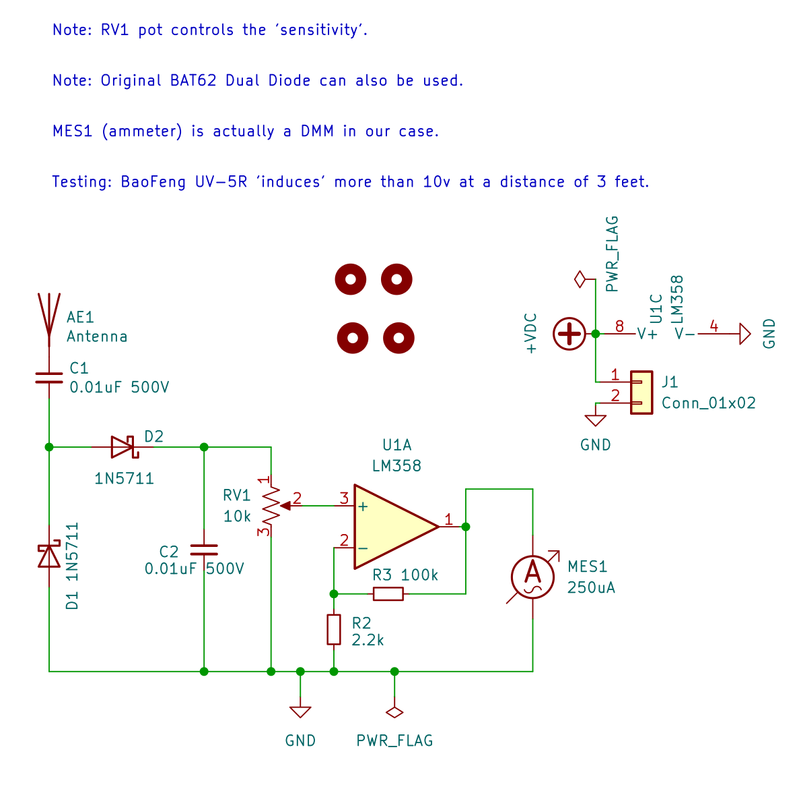
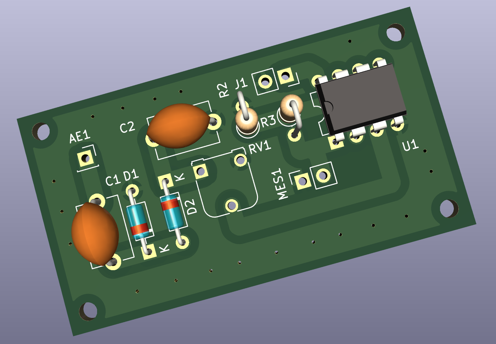
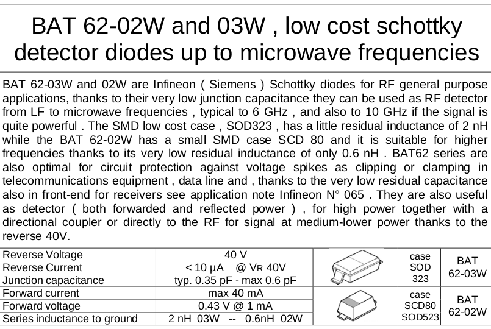

### Easy-Field-Strength-Meter

Jan-2022 UPDATE: v2 is published which works much better.

My old FSM build:

Testing the FSM using a common BaoFeng VHF+UHF handie:

'1N60' diodes work fine too:

Note: This particular build is using "1N60" diodes from https://www.electronicscomp.com/.
Their "1N34A Glass Type" diodes are also OK but are less sensitive.

#### Suitable Diodes

- 1N5711 diode - original from Semikart - preferred

- BAT62 Dual Schottky Diode (Detector Diode)

- "1N60" diode

- "1N34A" diode

- BAT54S - there is not much literature around this - avoid?

#### Tips

For detecting milliwatt(s) range of power, a SDR device (RTL-SDR / HackRF One /
Airspy Discovery+) works really well.

#### BOM

- 2 x 1N60 diodes *or* 1N5711 (preferred)
- 1 x 10k or 25k Potentiometer
- 2 x 0.01uF (10 nF) Non-Polar Capacitor, 500V
- 1 x LM358 (for v2)
- 1 x 100k, 1 x 2.2k Metal Film Resistors (for v2)
- 2 x Male banana plugs
- 1 x 1 or 2 inches of flexible electrical wire ("antenna")
- 1 x Wire-loop-roll works nicely for detecting HF RF power
- 2 x Few inches of PVC coated electrical wire (for connections to DMM)
- 1 x DMM
- 1 x 0.05uF Non-Polar Capacitor, 47nF is fine too (v1)
- 1 x 470pF Non-Polar Capacitor (v1)

#### BOM Sources

- https://www.semikart.com/ (BAT 62 Dual Diode - BAT62E6327HTSA1, 1N5711)

- https://projectpoint.in/ (High voltage non-polar capacitors, pots, connectors)

- https://projectpoint.in/ ("10nF 2k", "470pF 2kV", "47nF 630V")

- https://www.electronicscomp.com/ ("germanium" diodes, misc)

- https://www.electroncomponents.com/ ("germanium" diodes, misc)

- https://www.electronicscomp.com/1n34-germanium-diode-india - the displayed pic (looks like "zener") is not correct - ignore it. This actually is of "Glass Type DO-7" type.

- https://www.electronicscomp.com/1n60-germanium-diode-india?search=1n60 - this is not "glass type" but works better than their "glass type 1N34" one. This seems to be a DO-35 package.

- https://www.probots.co.in/ (project boxes/cases)

#### References

- [Radio Prepper's YouTube video - Building a Field Strength Meter.](https://www.youtube.com/watch?v=WfkNoV0a64U)

- [Schottky diodes selection guide](http://www.skoots.yolasite.com/resources/A.pdf) - superb!

- [Infineon - RF and microwave power detection with Schottky diodes](https://www.infineon.com/dgdl/Infineon-AN_1807_PL32_1808_132434_RF%20and%20microwave%20power%20detection%20-AN-v01_00-EN.pdf?fileId=5546d46265f064ff0166440727be1055) - lovely

- https://www.pasternack.com/t-calculator-power-conv.aspx (Watts to Volts)

- https://www.huyettm.net/field-strength-meter.html

- http://www.circuitdiagram.org/field-strength-meter-fsm.html

- https://www.instructables.com/id/RF-Meter-for-Multimeter/

- https://eu.mouser.com/images/vishay/images/do35.jpg

- http://www.w1air.com/images/RFDrivenOnAirIndicator.pdf (reference for v2)
